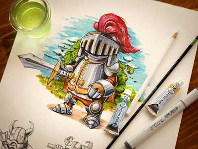

#三层div层叠效果
---
1. float与absolute都可以浮动元素，第一个元素用float自动在最底层。其它两个用absolute与z-index配合使用。

```html
	<li>
		
		<div class="caption">
			<div class="blur"></div>
			<div class="caption-text">
				<h1>Amazing Caption</h1>
				<p>Whatever It Is - Always Awesome</p>
			</div>
		</div>
	</li>
```
```css
.caption-style-4 img{
			margin: 0px;
			padding: 0px;
			float: left;
		}
```
2. 三个div都直接使用absolute与z-index配合使用
